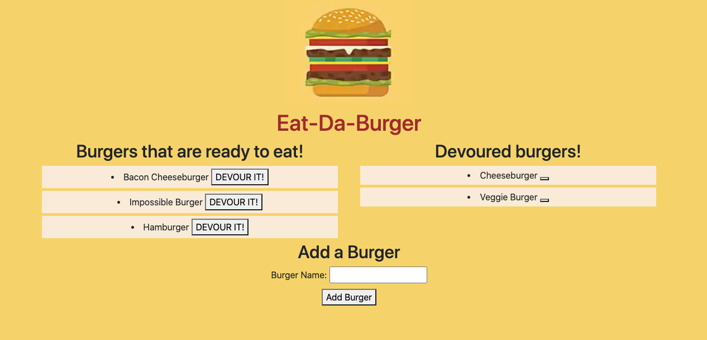

# Burger Logger

## Description
Eat-Da-Burger! is a restaurant app that lets users input the names of burgers they'd like to eat. Whenever a user submits a burger's name, the app will display the burger on the left side of the page -- waiting to be devoured. Each burger in the waiting area also has a `Devour it!` button. When the user clicks it, the burger will move to the right side of the page.

Following the MVC (Model-View-Controller) design pattern, this "Burger Logger" app, which is deployed using Heroku, uses Node and MySQL to query and route user input data, and Handlebars to generate the respective HTML, via the Express server framework, and a homemade ORM (Object-Relational Mapping).

## Table of Contents
* [Installation](#installation)
* [Usage](#usage)
* [License](#license)
* [Contributing](#contributing)
* [Questions](#questions)

## Installation
[Burger Logger App Link](https://rocky-journey-33890.herokuapp.com/)

## Usage

## License
This application is covered under the **GPL v3.0** license. Permissions of this strong copyleft license are conditioned on making available complete source code of licensed works and modifications, which include larger works using a licensed work, under the same license. Copyright and license notices must be preserved. Contributors provide an express grant of patent rights.

## Contributing
Please refer to the [Contributor Covenant](https://www.contributor-covenant.org/version/2/0/code_of_conduct/).

## Questions
Please direct any questions regarding this application to the developer @[HumbleKind](https://github.com/HumbleKind) (GitHub), or via email at christian_sinai@me.com.